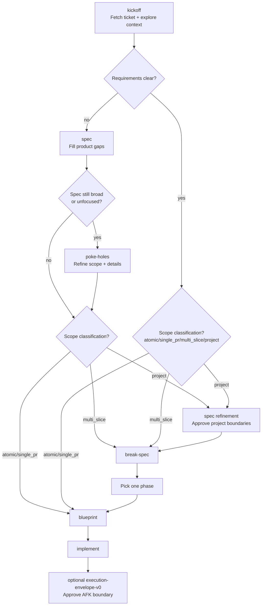
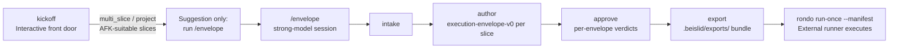
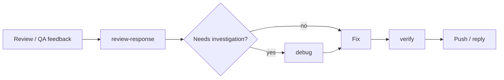
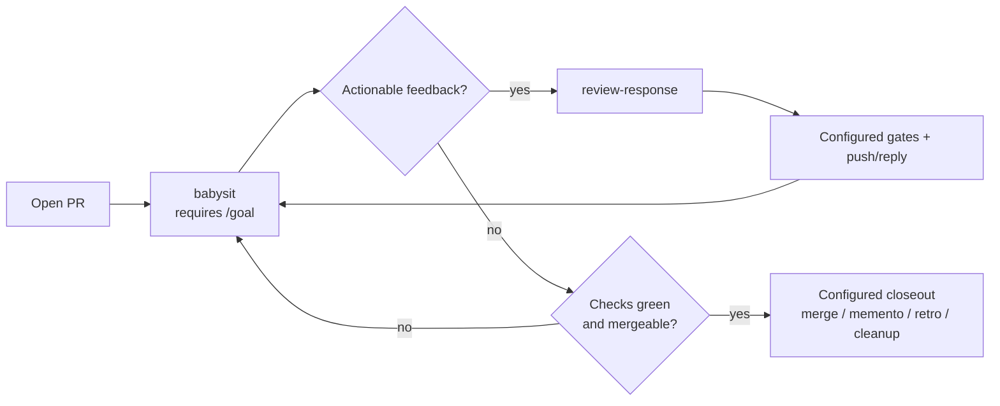
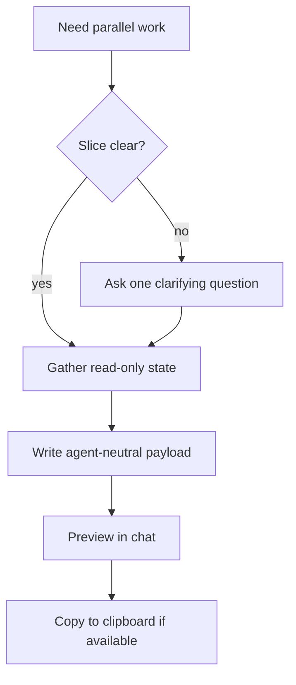

# Beislið workflows

Beislið skills compose into workflows. Use this as the routing reference once you know the basics from [How to use Beislið](./how-to-use.md). For guidance on configuring workflows for your team, see [Workflow authoring](./workflow-authoring.md).

## Lifecycle artifacts and reports

Beislið standardizes lifecycle records in [`.beislid/artifact-templates.md`](../.beislid/artifact-templates.md): spec, blueprint, implementation plan, verification report, review report, fresh-eyes report, ship summary, and feedback response log. The default is local/chat artifacts for planning, verification, and review evidence; public ticket/PR surfaces get terse summaries or approved replies unless workflow config or explicit instructions require the full artifact.

## Mainline feature flow

Use this when an idea starts as product work and needs to become code.

```mermaid
flowchart LR
  A["spec<br/>Shape requirements"] --> P{"Spec still broad<br/>or unfocused?"}
  P -- "yes" --> Q["poke-holes<br/>Pressure-test scope + details"]
  P -- "no" --> B{"Too large<br/>for one PR?"}
  Q --> B
  B -- "yes" --> C["break-spec<br/>Phase into vertical slices"]
  B -- "no" --> D["blueprint<br/>Design implementation"]
  C --> E["Pick one phase"]
  E --> D
  D --> F["implement<br/>Plan execution"]
  F --> X["optional execution-envelope-v0<br/>Approve AFK boundary"]
  X --> G["Build / change code"]
  G --> H["verify<br/>Evidence before claims"]
  H --> K{"Want pre-PR<br/>hardening loop?"}
  K -- "yes" --> L["rinse<br/>Review / fix / verify"]
  K -- "no" --> J["ready-for-review<br/>review + final check + PR"]
  L --> J
```

Routing rules:

- Start with `spec` when product behavior, success criteria, or scope are unclear.
- Use `spec` to finalize a `work-contract-v1` section or artifact when the next skill needs stable requirements for automation handoff.
- Use an `execution-envelope-v0` fixture when a clear slice needs human-approved autonomy, proof, pause, dependency, delivery, and ownership boundaries before AFK execution. External runners may consume approved envelopes as Beislið ProcessProvider semantics, but Beislið still does not own execution internals.
- Use `poke-holes` after `spec` when the spec is still broad, unfocused, or needs pressure before implementation design.
- Skip to `blueprint` only when the desired behavior is known and implementation design is the remaining question; an approved Work Contract counts as that requirements input.
- Use Work Contract `scope_classification` for routing: `atomic`/`single_pr` go to `blueprint`, `multi_slice` goes to `break-spec`, and `project` starts with spec refinement before slice planning.
- Use `implement` after the design is approved. It creates the file-level execution plan and task list.
- When configured, `break-spec`, `spec`, and `blueprint` run approved-planning lifecycle actions after approval; artifact actions write default `plans/` paths or configured custom templates that downstream skills can rediscover later, CLI actions run configured side effects inside action-policy boundaries, and `spec` can post the approved spec body back into the ticket body through the configured tracker action.
- Use `verify` before any done/fixed/passing claim.
- Use `rinse` when you want an approved review/fix/verify loop before PR handoff.
- Use `ready-for-review` when a branch is ready to go through quality gates, review, the configured final check, ship-time planning-artifact narration, push, and PR creation. See [worktree isolation](./worktree-isolation.md) for isolated agent work and cleanup expectations.

## Ticket flow

Most ticket work starts with `kickoff`. It reads `<repo>/.beislid/workflow.md`, fetches the ticket when configured, explores the codebase, then routes to the right next step.

Use the routing this way:

- `spec` when the ticket is vague, product behavior is unclear, success criteria are missing, or multiple interpretations are plausible.
- `kickoff` may derive a `work-contract-v1` context packet from a tracker issue; missing contract fields stay as unknowns or human decisions.
- `poke-holes` after `spec` when the shaped spec still needs pressure, focus, or detail refinement.
- `scope_classification` is canonical when present: `atomic` and `single_pr` route to `blueprint`; `multi_slice` routes to `break-spec`; `project` routes to spec refinement first, then slice planning once boundaries are approved; `unknown` routes to continued refinement, not automation handoff.
- `break-spec` when the requirement is classified as `multi_slice`, or as `project` after project boundaries are approved; approved structures can be written through lifecycle actions when configured.
- `blueprint` when the desired behavior is known and the remaining work is implementation design; an approved Work Contract is a primary requirements handoff.
- `execution-envelope-v0` can then constrain AFK execution with explicit `allow` / `ask` / `deny`, proof requirements, pause conditions, dependencies, expected delivery, and ownership boundaries. External runners can consume that approved boundary instead of scraping chat, while Rondo or another runner owns execution/run evidence.
- If planning lifecycle actions are configured, `break-spec` / `spec` / `blueprint` own those approval events and return lifecycle status/path to kickoff for handoff and ticket-update context.
- If checkpoint artifact lifecycle actions are configured, `kickoff` can write `kickoff_context_ready` after readiness routing, and `implement` can write `implementation_plan_created` after the task plan but before code changes. These checkpoints are safe points to clear context manually and later say “continue this ticket” or “continue from checkpoint.” In Pi, managed Beislið extension commands can automatically start a fresh session from a readable checkpoint pointer at configured boundaries; downstream planning artifacts can still be rediscovered later from their workflow-configured templates and latest pointer entries when those are written, but planning approval events stay rediscovery-only unless `pi_handoff.events` explicitly opts into them.
- For Rondo-style durable run state, orchestrators can additionally use `beislid run-ledger ...`. The ledger stores run IDs, events, gate log indexes, interruptions, and final reports under `${BEISLID_STATE_DIR:-~/.local/state/beislid}/runs/<flow>/<repo_hash>/<run_id>/`; it links to checkpoint artifacts instead of replacing them.

## Envelope flow (AFK execution)

Use this when approved slices should run away-from-keyboard through an external runner instead of an interactive implementation session. `kickoff` stays the interactive front door: when it classifies work as `multi_slice` or `project` with AFK-suitable slices, it *recommends* running `/envelope` in a strong-model session — it never auto-routes into it.

Routing rules:

- `/envelope` is explicit-trigger only. The human chooses which model/session pays for authoring; other skills may recommend it but never invoke it.
- The flow is intake → author → approve → export. Approval is per envelope with verdicts approve / reject / demote-to-HITL; rejected envelopes never block the rest of the batch.
- Export produces a repo-committed `approved-slice-plan-export-v0` bundle under `.beislid/exports/`, gated by `scripts/validate_export.py` before checkpoint/commit. The contract lives in [Configuration](./configuration.md) under "Export bundles (`.beislid/exports/`)".
- An external runner such as `rondo run-once --manifest <slice-manifest>` consumes the approved slices in a fresh session; rondo owns execution and run evidence, and supersedes stale exports by manifest hash. Beislið owns envelope/export semantics only.

## Feedback loop

Use this after PR review or QA feedback.

`review-response` is for responding to feedback someone else already left. It reads PR review and ticket/QA sources from `<repo>/.beislid/workflow.md`, then posts through configured update paths or prints manual replies.

It is not for writing reviews on other people's PRs, starting new ticket work, or opening a fresh PR.

## PR babysitting loop

Use `babysit` when a PR is already open and should be monitored through review comments, configured gates, CI, mergeability, and optional closeout automation.

`babysit` requires goal support. Claude includes `/goal`; Pi users need the `pi-goal` package enabled. Closeout automation is controlled by `beislid:babysit` and action policy, so `auto` still stops on policy denials, unsafe conflicts, red/pending checks, missing credentials, or judgment calls.

The closeout stages run in order: `merge`, `memento`, `retro`, `cleanup`. `cleanup` runs last and only after a successful merge; it follows `closeout.merge.mode` unless given its own mode. It proves no branch content is unlanded, closes the ticket through the configured tracker, deletes the merged remote branch, and reports the worktree path and branch as ready for removal without removing either — the agent is running inside that worktree, so the supervising session removes it.

## Split-work handoff

Use `handoff` when part of the work needs to move to another agent, session, or worktree.

`handoff` only produces a paste-ready prompt. It does not create tickets, commits, branches, worktrees, or repo files, and it does not paste full diffs.

Examples:

- "handoff frontend"
- "handoff QA for the payment flow"
- "make a handoff for the migration"
- "copy context for another agent to handle docs"

For same-session resume, use a memory/checkpoint tool if your environment provides one. When workflow checkpoint artifacts are configured, boundary skills also update `.beislid/checkpoints/latest.json` so a fresh context can rediscover the latest checkpoint for the branch/ticket. In Pi, managed Beislið extension commands can use that pointer to create a replacement session automatically; Claude and other hosts keep the manual `/clear` or fresh-context guidance. For durable Rondo-style resume, use `beislid run-ledger resume --flow <flow> --ticket-id <id> --branch <branch>` to find the latest matching running/interrupted/failed run in external Beislið state. `handoff` is for cross-session or cross-agent transfer.

## Standalone pressure tools

Use these directly when the situation calls for them:

| Situation | Use |
|---|---|
| Plan or design needs pressure | `poke-holes` |
| Bug, failing test, or unexpected behavior | `debug` |
| Completion claim needs evidence | `verify` |
| Local or supplied diff needs review | `review` |
| Post-fix whole diff needs a final pass | `fresh-eyes` |
| Review findings need a fix/verify loop | `rinse` |
| Open PR needs goal-backed babysitting | `babysit` |
| Someone else's PR needs review | `pr-patrol` |
| Your own diff needs a human walkthrough | `walk-the-diff` |
| Parallel session needs context | `handoff` |
| Evidence needs a visual artifact | `show-me` |

## Side-effect boundaries

`review` and `fresh-eyes` are primitives. They do not edit files, commit, push, post comments, update tickets, or create PRs.

Orchestration skills such as `rinse`, `pr-patrol`, `review-response`, `babysit`, and `ready-for-review` decide what to do with findings after user approval.
