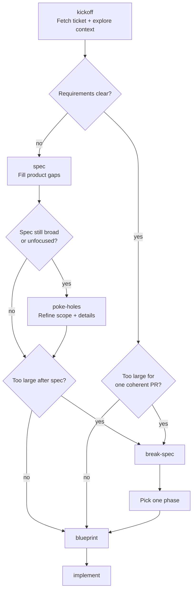
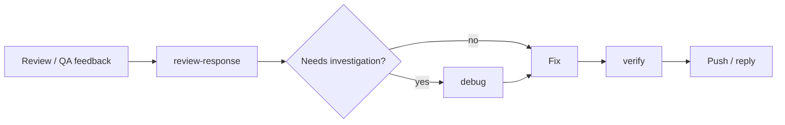
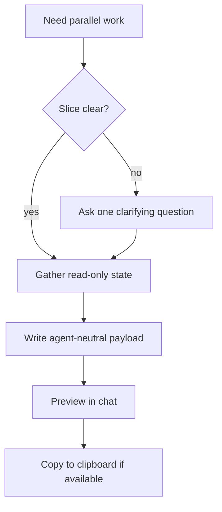

# Beislið workflows

Beislið skills compose into workflows. Use this as the routing reference once you know the basics from [How to use Beislið](./how-to-use.md).

## Mainline feature flow

Use this when an idea starts as product work and needs to become code.

```mermaid
flowchart LR
  A["spec<br/>Shape requirements"] --> P{"Spec still broad<br/>or unfocused?"}
  P -- "yes" --> Q["poke-holes<br/>Pressure-test scope + details"]
  P -- "no" --> B{"Too large<br/>for one PR?"}
  Q --> B
  B -- "yes" --> C["break-spec<br/>Phase into vertical slices"]
  B -- "no" --> D["blueprint<br/>Design implementation"]
  C --> E["Pick one phase"]
  E --> D
  D --> F["implement<br/>Plan execution"]
  F --> G["Build / change code"]
  G --> H["verify<br/>Evidence before claims"]
  H --> K{"Want pre-PR<br/>hardening loop?"}
  K -- "yes" --> L["rinse<br/>Review / fix / verify"]
  K -- "no" --> J["ready-for-review<br/>review + final check + PR"]
  L --> J
```

Routing rules:

- Start with `spec` when product behavior, success criteria, or scope are unclear.
- Use `spec` to finalize a `work-contract-v1` section or artifact when the next skill needs stable requirements for automation handoff.
- Use `poke-holes` after `spec` when the spec is still broad, unfocused, or needs pressure before implementation design.
- Skip to `blueprint` only when the desired behavior is known and implementation design is the remaining question; an approved Work Contract counts as that requirements input.
- Use `break-spec` when the approved work is too large for one coherent PR.
- Use `implement` after the design is approved. It creates the file-level execution plan and task list.
- When configured, `spec` and `blueprint` write local planning artifacts after approval through lifecycle actions; default `plans/` paths feed downstream skills.
- Use `verify` before any done/fixed/passing claim.
- Use `rinse` when you want an approved review/fix/verify loop before PR handoff.
- Use `ready-for-review` when a branch is ready to go through quality gates, review, the configured final check, push, and PR creation.

## Ticket flow

Most ticket work starts with `kickoff`. It reads `<repo>/.beislid/workflow.md`, fetches the ticket when configured, explores the codebase, then routes to the right next step.

Use the routing this way:

- `spec` when the ticket is vague, product behavior is unclear, success criteria are missing, or multiple interpretations are plausible.
- `kickoff` may derive a `work-contract-v1` context packet from a tracker issue; missing contract fields stay as unknowns or human decisions.
- `poke-holes` after `spec` when the shaped spec still needs pressure, focus, or detail refinement.
- `break-spec` when the requirement is clear but too large for one PR.
- `blueprint` when the desired behavior is known and the remaining work is implementation design; an approved Work Contract is a primary requirements handoff.
- If planning artifact lifecycle actions are configured, `spec` / `blueprint` own those approval events and return artifact status/path to kickoff for handoff and ticket-update context.
- If checkpoint artifact lifecycle actions are configured, `kickoff` can write `kickoff_context_ready` after readiness routing, and `implement` can write `implementation_plan_created` after the task plan but before code changes. These checkpoints are safe points to clear context manually and later say “continue this ticket” or “continue from checkpoint.”
- For Rondo-style durable run state, orchestrators can additionally use `beislid run-ledger ...`. The ledger stores run IDs, events, gate log indexes, interruptions, and final reports under `${BEISLID_STATE_DIR:-~/.local/state/beislid}/runs/<flow>/<repo_hash>/<run_id>/`; it links to checkpoint artifacts instead of replacing them.

## Feedback loop

Use this after PR review or QA feedback.

`review-response` is for responding to feedback someone else already left. It reads PR review and ticket/QA sources from `<repo>/.beislid/workflow.md`, then posts through configured update paths or prints manual replies.

It is not for writing reviews on other people's PRs, starting new ticket work, or opening a fresh PR.

## Split-work handoff

Use `handoff` when part of the work needs to move to another agent, session, or worktree.

`handoff` only produces a paste-ready prompt. It does not create tickets, commits, branches, worktrees, or repo files, and it does not paste full diffs.

Examples:

- "handoff frontend"
- "handoff QA for the payment flow"
- "make a handoff for the migration"
- "copy context for another agent to handle docs"

For same-session resume, use a memory/checkpoint tool if your environment provides one. When workflow checkpoint artifacts are configured, boundary skills also update `.beislid/checkpoints/latest.json` so a fresh context can rediscover the latest checkpoint for the branch/ticket. For durable Rondo-style resume, use `beislid run-ledger resume --flow <flow> --ticket-id <id> --branch <branch>` to find the latest matching running/interrupted/failed run in external Beislið state. `handoff` is for cross-session or cross-agent transfer.

## Standalone pressure tools

Use these directly when the situation calls for them:

| Situation | Use |
|---|---|
| Plan or design needs pressure | `poke-holes` |
| Bug, failing test, or unexpected behavior | `debug` |
| Completion claim needs evidence | `verify` |
| Local or supplied diff needs review | `review` |
| Post-fix whole diff needs a final pass | `fresh-eyes` |
| Review findings need a fix/verify loop | `rinse` |
| Someone else's PR needs review | `pr-patrol` |
| Your own diff needs a human walkthrough | `walk-the-diff` |
| Parallel session needs context | `handoff` |
| Evidence needs a visual artifact | `show-me` |

## Side-effect boundaries

`review` and `fresh-eyes` are primitives. They do not edit files, commit, push, post comments, update tickets, or create PRs.

Orchestration skills such as `rinse`, `pr-patrol`, `review-response`, and `ready-for-review` decide what to do with findings after user approval.
